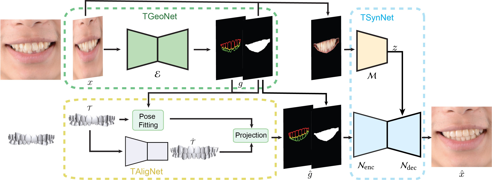

# iOrthoPredictor
The source code of "TSynNet" for our paper "[iOrthoPredictor: Model-guided Deep Prediction of Teeth Alignment](http://kunzhou.net/2020/iteeth-siga20.pdf)" (SIGGRAPH ASIA 2020)

We propose a novel framework for visual prediction of orthodontic treatment.
The entire framework is shown as follows:

  
  

