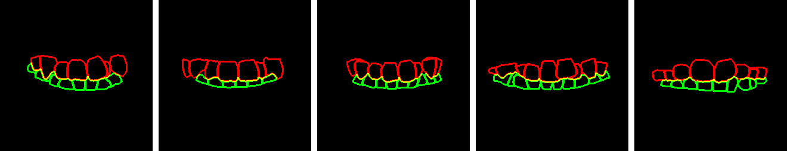

# iOrthoPredictor
The source code of "TSynNet" for our paper "[iOrthoPredictor: Model-guided Deep Prediction of Teeth Alignment](http://kunzhou.net/2020/iteeth-siga20.pdf)" (SIGGRAPH ASIA 2020)

We propose a novel framework for visual prediction of orthodontic treatment.
The entire framework is as follows:

  
  

Our TSynNet automatically disentangles teeth geometry and appearance, 
enabling visual prediction of orthodontics under the guidance of the synthesized geometry maps:

  
    
    
    

 
  <b>upper most</b>: original images. <b>middle</b>: sythesized geometry maps. <b>lower most</b>: results.

## Prerequisites
- Linux
- Python 3.6
- NVIDIA GPU + CUDA cuDNN
- tensorflow-gpu 1.13.1

## Getting Started
### Installation

### Testing 
- Please first download example dataset by running `python scripts/download_datasets.py`.
