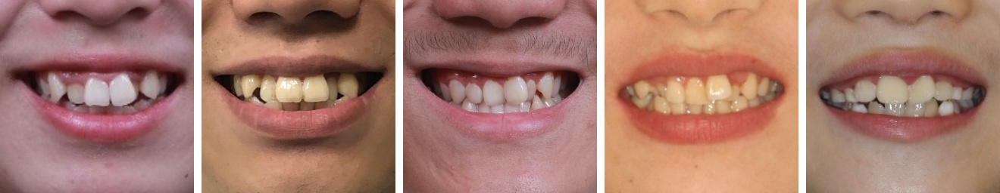

# iOrthoPredictor
The source code of "TSynNet" for our paper "[iOrthoPredictor: Model-guided Deep Prediction of Teeth Alignment](http://kunzhou.net/2020/iteeth-siga20.pdf)" (SIGGRAPH ASIA 2020)

We propose a novel framework for visual prediction of orthodontic treatment.
The entire framework is as follows:

<p align='center'>  
  
</p>

Our TSynNet automatically disentangles teeth geometry and appearance, 
enabling visual prediction of orthodontics under the guidance of the synthesized geometry maps:

<p align='center'>  
    
    
</p>
<p align='center'> 
  <b>upper most</b>: original images. <b>middle</b>: sythesized geometry maps. <b>lower most</b>: results.
</p>

## Prerequisites
- Linux
- Python 3.6
- NVIDIA GPU + CUDA cuDNN
- tensorflow-gpu 1.13.1


## Getting Started
- Conda installation:
    ```bash
    # 1. Create a conda virtual environment.
    conda create -n tsyn python=3.6 -y
    source activate tsyn
    
    # 2. Install dependency
    pip install -r requirement.txt
    ```
- Please download the example dataset by running:
    ```bash
    python scripts/download_dataset.py
    ```

## Testing 
- Please download **the pre-trained weights** by running:
    ```bash
     python scripts/download_model.py
    ```
- Test the model by running: 
    ```bash
     python test.py --use_gan --use_style_cont --use_skip
    ```
- You can check the results in examples/cases_for_testing

## Training
- Before training with your own dataset, 
please make it compatible with the data loader in data/data_loader.py.
- Please download **the pre-trained vgg weights** by running:
    ```bash
    python scripts/download_vgg.py
    ```
- Train the model by running:
    ```bash
    python train.py --use_gan --use_style_cont --use_skip
    ```
